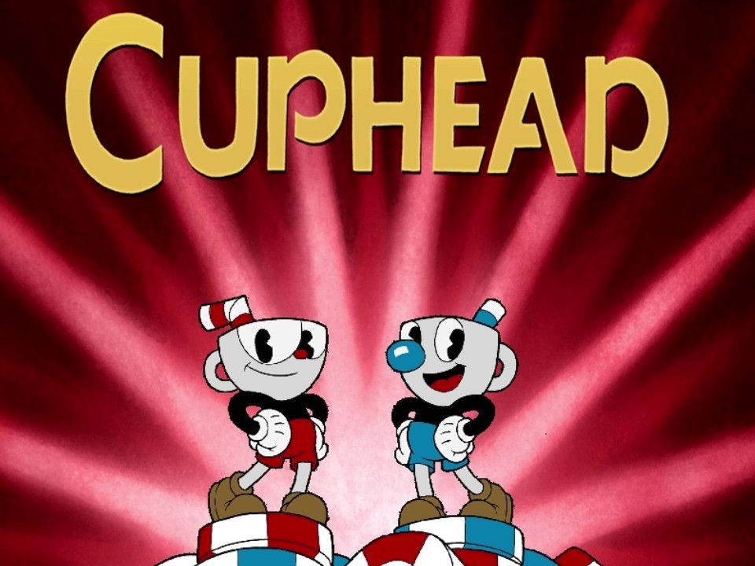
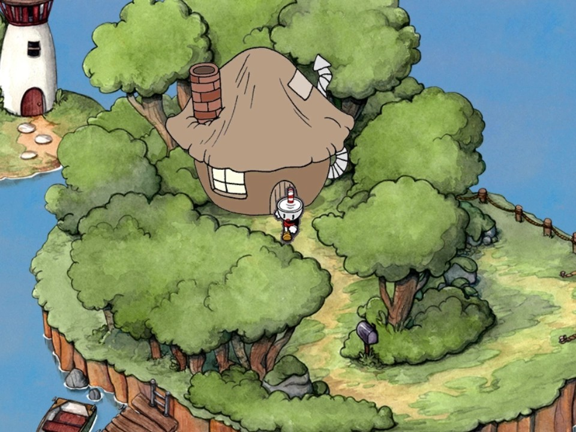
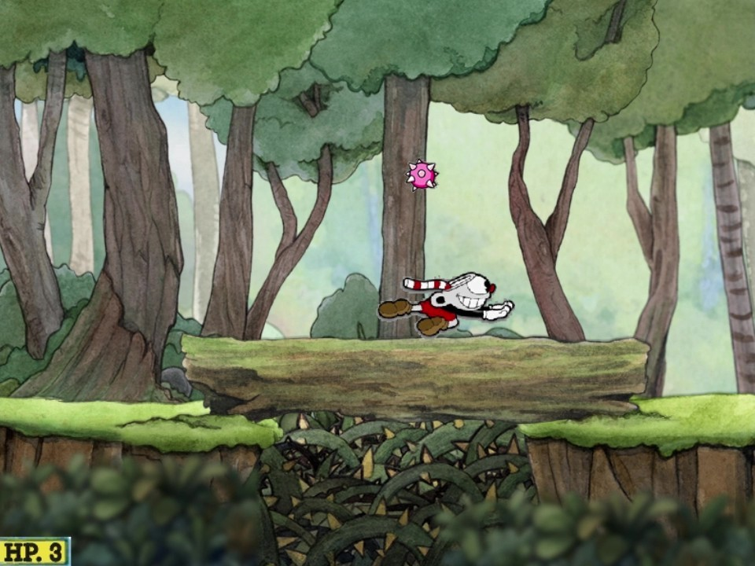
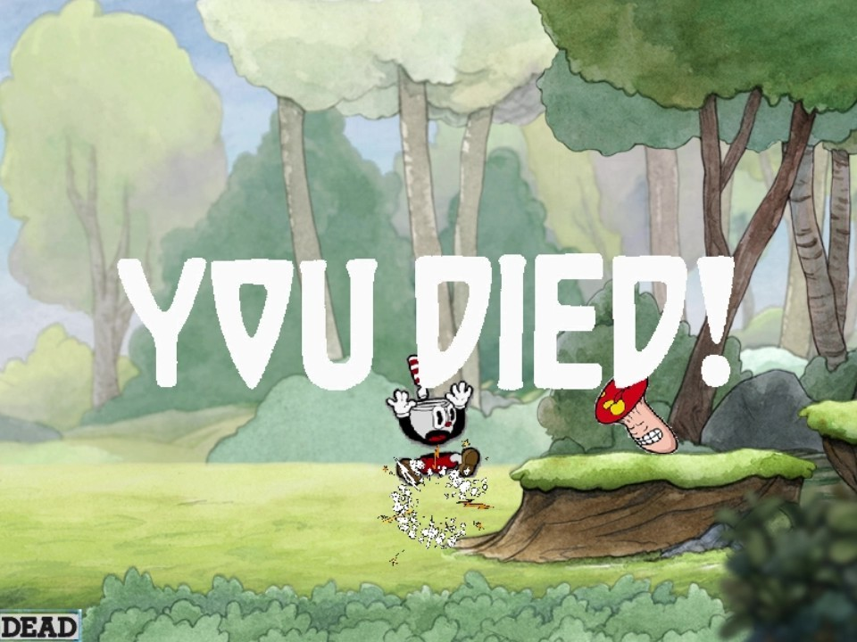
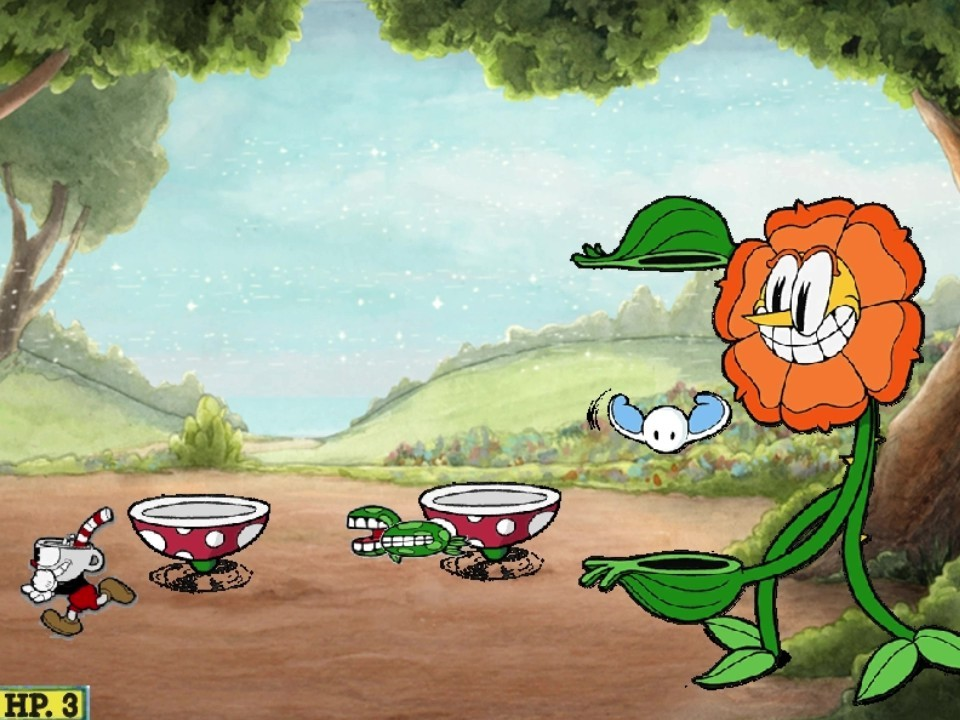

# winapi-cuphead
C++ WinAPI 기반 2D 횡스크롤 액션 어드벤처 게임 'Cuphead' 모작

C++ WinAPI로 구현한 2D 액션 게임 'Cuphead' 모작 프로젝트의 대표 코드 발췌.

    <table>
        <tr>
            <td></td>
            <td></td>
        </tr>
        <tr>
            <td></td>
            <td></td>
        </tr>
        <tr>
            <td></td>
            <td></td>
        </tr>
    </table>

    <a href="https://MyYouTubeLink" target="_blank">
        YouTube
    </a>

